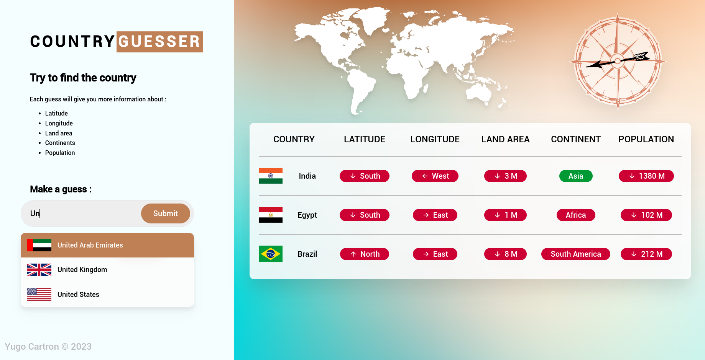

# 🌍 Country Guesser 🌍



### Welcome on Country-Guesser!

Your job is to find the country!
Each guess will give you more information about the position,
the land area, the continent and the population.

## Table of content
- [Installation 🚀](#installation--) 
- [How to play 🕹️](#how-to-play-)


## Installation 🚀 
To set up the game please clone the git repository, then 

```bash
npm install
npm run dev
```

It'll install and launch the game on your localhost. Please go to the address mentioned by npm.
It should be something like : 

```bash
  ➜  Local:   http://localhost:5173/
```

## How to play 🕹️

When you start a game, the application selects a random country among all the [known countries](src/assets/countries.json)
(source from https://restcountries.com/v3.1/all). 

Each guess will give you 5 answers :

- **Latitude** :  Does the final country is **farthest north** or **south** ?
- **Longitude** :  Does the final country is **farthest west** or **east** ?
- **Land area** : Does the final country is **larger** or **smaller** ?
- **Continent** : Does the final country is on the same **continent** ?
- **Population** : Does the final country is **more** or **less populated** ?

Moreover the compass will give you the exact direction from your last guess to the final country.

After your fifth guess, you'll unlock the **hint** button that'll display the **country flag** if you click on it.

### Enjoy the game and have fun! 🤩